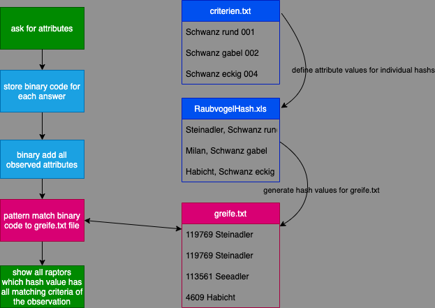

# Greifvogel Identifyer

Perl script with command line interface to select the right raptor baswed on observations in nature

## Target

The target of the Perl script is to help identify a spotted raptor and get all relevant options in Germany. The basic idea of the algorithm is to define a unique hash value based on power of 2 to every possible  observation. Each raptor then gets a unique hash value which is the binary added hash values of all observations that would fit to his type. During comparison not observed criteria result positive for all raptors.

## High Level Architecture

### Component View

The perl script runs on two different .txt files which contain comma seperated values. The following daigram shows a draft overview how the scrip is connected to the files. The greife.txt file needs to be generated manually upfront to how the matching patterns available.

### List of criteria and hash values

| Hash | Criteria |
| --- | --- |
| 1 | Schwanz rund |
| 2 | Schwanz Gabel |
| 4 | Schwanz eckig |
| 8 | Fluegel gefingert |
| 16 | Fluegel schmal |
| 32 | Fluegel gebaendert |
| 64 | Fluegel hat helle Felder |
| 128 | riesig (180-220) |
| 256 | gross (120-180) |
| 512 | mittel(80-120) |
| 1024 | klein (60-80) |
| 2048 | Kueste |
| 4096 | Wald-Wiese |
| 8192 | Gebirge |
| 16384 | Siedlung |
| 32768 | Sommer |
| 65536 | Winter |
| 131072 | kreist |
| 262144 | ruettelt |
| 524288 | Luftjagd |
| 1048576 | ruft |

### List of raptors and respective hash values

| Hash | Raptor |
| --- | --- |
| 119769 | Steinadler |
| 113561 | Seeadler |
| 1451097 | Maeusebussard |
| 1098809 | Wespenbussard |
| 1401945 | Rauhfussbussard |
| 123994 | Rotmilan |
| 74779 | Schwarzmilan |
| 648284 | Rohrweihe |
| 116093 | Kornweihe |
| 50493 | Wiesenweihe |
| 4609 | Habicht |
| 381973 | Turmfalke |
| 569877 | Baumfalke |
| 635413 | Wanderfalke |
| 1044 | Sperber |

## Execute

If you want to run the script, please make sure the two .txt files are in place:

+ criteren.txt -> list of criteria build from .xls file with unique hash value
+ greife.txt -> generated hash value per raptor to identify observation pattern

To start script, please type:

> `perl greifvogel.ps criterien.txt greife.txt`

if you need help, please use:

> `perl greifvogel.ps criterien.txt greife.txt -h`

if you want to see additional options, which would also fit to the observation, please use:

> `perl greifvogel.ps criterien.txt greife.txt -v`

During the questions, the user has to answer with 0/1 patterns. He has to provide one digit for each provided option (1-true). If the pattern does not match, a 0 pattern is applied, which results in all options.

## Version information

> works with: perl 5, version 18
